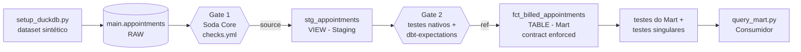

# Data Product de Faturamento Hospitalar — DBT + DuckDB

**Disciplina:** Data Product Management & Value Delivery  
**Professor:** Rafael Matsuyama  
**Turma:** 8ABDR  
**Trilha:** Engenharia e Qualidade — Entrega **Mandatória + Bônus 1, 2 e 3**  
**Domínio de Negócio:** Saúde (Faturamento de Atendimentos Médicos)  
**Stack:** dbt-core / dbt-duckdb / dbt-expectations / Soda Core / SQL Modular / DuckDB / Python 3.12.1

---

## Equipe

| RM | NOME |
|---|---|
| 368317 | Alef Anderson Fernandes Clarindo da Silva |
| 369112 | Antônio José dos Santos Neto |
| 367719 | Caio Ruiz de Souza |
| 368679 | Clayton Ritchelly C Leite |
| 368284 | Luiz Francisco Feltrim Junior |

---

## Sumário

- [Equipe](#equipe)
- [Objetivo](#objetivo)
  - [Problema de negócio](#problema-de-negócio)
  - [Glossário](#glossário)
- [Arquitetura](#arquitetura)
  - [Estrutura do projeto](#estrutura-do-projeto)
  - [Dataset sintético](#dataset-sintético)
- [Passo a Passo](#passo-a-passo)
  - [Passo 1: Ativar o ambiente virtual](#passo-1-ativar-o-ambiente-virtual)
  - [Passo 2: Instalar as dependências (no venv)](#passo-2-instalar-as-dependências-no-venv)
  - [Passo 3: Gerar a base analítica sintética](#passo-3-gerar-a-base-analítica-sintética)
  - [Passo 4: Validar a conexão do dbt com o DuckDB](#passo-4-validar-a-conexão-do-dbt-com-o-duckdb)
  - [Passo 5: Camada de Staging](#passo-5-camada-de-staging)
  - [Passo 6: Mart com Model Contract enforced](#passo-6-mart-com-model-contract-enforced)
  - [Passo 7: Inspecionar o Data Product](#passo-7-inspecionar-o-data-product)
- [Bônus 1: Testes Estatísticos (dbt-expectations)](#bônus-1-testes-estatísticos-dbt-expectations)
- [Bônus 2: Regra Contábil (Testes Singulares)](#bônus-2-regra-contábil-testes-singulares)
- [Esteira de qualidade com dbt build](#esteira-de-qualidade-com-dbt-build)
- [Bônus 3: DAG Circuit Breaker](#bônus-3-dag-circuit-breaker)
  - [Duas barreiras de proteção](#duas-barreiras-de-proteção)
  - [Demonstração automatizada](#demonstração-automatizada)
  - [Passo a passo manual do incidente](#passo-a-passo-manual-do-incidente)
- [Execução ponta a ponta](#execução-ponta-a-ponta)
- [Critérios de Aceite](#critérios-de-aceite)

---

## Objetivo

Construir o pipeline analítico de um **Produto de Dados de Faturamento Hospitalar**, em duas camadas (**Staging + Mart**). A tabela de consumo (`fct_billed_appointments`) é protegida por um **Model Contract nativo do dbt** (`contract: {enforced: true}`). Assim, os consumidores (Financeiro, Auditoria de Contas Médicas, BI) não sofrem com quebras silenciosas de schema ou de tipos.

### Problema de negócio

O hospital precisa acompanhar quanto fatura por atendimento, quanto perde em **glosas** (valores negados pelas operadoras) e quanto recebe de **coparticipação** do paciente. Ele também precisa saber quanto ainda tem **a receber** de cada fonte pagadora (SUS, Particular e convênios). Se a tabela que alimenta esses números mudar de schema sem aviso, os relatórios financeiros quebram. O contrato existe para evitar isso.

### Glossário

| Termo | Coluna | Definição |
|---|---|---|
| Valor faturado | `billed_amount` | Valor bruto cobrado pelo atendimento |
| Glosa | `denied_amount` | Parte do valor negada pela fonte pagadora |
| Coparticipação | `copay_amount` | Parte paga diretamente pelo paciente |
| Valor líquido | `net_amount` | `billed_amount - denied_amount` |
| A receber da pagadora | `plan_receivable` | `net_amount - copay_amount` |

---

## Arquitetura



### Estrutura do projeto

```text
.
├── README.md
├── requirements.txt                            # Dependências Python
├── docs/                                       # Enunciado e documentos de referência
├── data/                                       # analytics.duckdb (gerado; fora do Git)
├── scripts/                                    # Pontos de entrada: execução ponta a ponta
│   ├── run_pipeline.ps1 / .sh                  # Esteira completa (Windows / Linux-macOS)
│   └── run_circuit_breaker.ps1 / .sh           # Demonstração do Circuit Breaker (Bônus 3)
└── src/
    ├── synthetic_data/                         # 1. Gera, corrompe e restaura a base bruta
    │   ├── setup_duckdb.py                     # Gerador da base sintética (data/analytics.duckdb)
    │   ├── inject_anomaly.py                   # Injeta dados corrompidos na origem (Bônus 3)
    │   └── restore_data.py                     # Restaura a base ao estado canônico (Bônus 3)
    ├── quality_gate/                           # 2. Gate 1: Soda Core na ingestão (Bônus 3)
    │   ├── configuration.yml                   # Conexão do Soda Core ao DuckDB
    │   └── checks.yml                          # Regras SodaCL
    ├── dbt/                                    # 3. Projeto dbt: Gate 2 + Data Product
    │   ├── dbt_project.yml                     # Configuração mestre do projeto dbt
    │   ├── profiles.yml                        # Perfil de conexão ao DuckDB
    │   ├── packages.yml                        # Pacote dbt-expectations (Bônus 1)
    │   ├── models/
    │   │   ├── staging/
    │   │   │   ├── sources.yml             # Declaração da fonte raw_sources.appointments
    │   │   │   ├── schema.yml              # Testes nativos + dbt-expectations (Gate 2)
    │   │   │   └── stg_appointments.sql    # Padronização e tipagem explícita
    │   │   └── marts/
    │   │       ├── fct_billed_appointments.sql  # Regras de valor (líquido / a receber)
    │   │       └── schema.yml              # Model Contract enforced + testes
    │   └── tests/
    │       ├── assert_billing_reconciliation.sql       # Regra contábil (Bônus 2)
    │       └── assert_staging_mart_reconciliation.sql  # Integridade cruzada Staging x Mart (Bônus 2)
    └── inspection/                             # 4. Consumo e evidências
        ├── query_mart.py                       # Inspecionador do Data Product
        └── query_test_results.py               # Inspecionador dos resultados de qualidade
```

As pastas de `src/` seguem o caminho dos dados: geração → Gate 1 → dbt → consumo.

### Dataset sintético

O `setup_duckdb.py` gera **1.000 atendimentos** de forma reproduzível (seed fixa = 42). O script usa só a biblioteca padrão do Python e o `duckdb`. As regras do gerador:

- 7 especialidades, cada uma com sua faixa de preço (ex.: Neurologia de R$ 300 a R$ 3.000; Clínica Geral de R$ 120 a R$ 400).
- Fontes pagadoras: `SUS`, `PARTICULAR`, `VIDA_PLENA`, `SAUDE_MAIS` e `BEM_ESTAR`.
- Status: `COMPLETED` (75%), `CANCELLED` (10%), `NO_SHOW` (8%) e `DENIED` (7%).
- Glosa só acontece em convênios (cerca de 20% dos atendimentos, de 5% a 40% do valor).
- Coparticipação de 30% para `VIDA_PLENA` e `SAUDE_MAIS`. `SUS` e `PARTICULAR` não têm coparticipação (no `PARTICULAR`, a fonte pagadora é o próprio paciente).

---

## Passo a Passo

> [!NOTE]
> Rode **todos** os comandos a partir da **raiz do repositório**. Use **sempre** o ambiente virtual `.venv`.
>
> O projeto roda em **Windows** (PowerShell) e em **Linux/macOS** (bash). Só o Passo 1 muda entre os sistemas. Do Passo 2 em diante, os comandos `python`, `dbt` e `soda` são os mesmos com o venv ativado.

### Passo 1: Ativar o ambiente virtual

**Windows (PowerShell):**

```powershell
Set-ExecutionPolicy -Scope Process -ExecutionPolicy RemoteSigned
.\.venv\Scripts\Activate.ps1
$env:DBT_PROJECT_DIR = "src/dbt"
$env:DBT_PROFILES_DIR = "src/dbt"
```

**Linux/macOS (bash):**

```bash
python3 -m venv .venv # Apenas na primeira vez
source .venv/bin/activate
export DBT_PROJECT_DIR=src/dbt
export DBT_PROFILES_DIR=src/dbt
```

As variáveis `DBT_PROJECT_DIR` e `DBT_PROFILES_DIR` dizem ao dbt onde ficam o `dbt_project.yml` e o `profiles.yml`. Com elas, os comandos `dbt` rodam da raiz sem flags extras. Elas equivalem a `--project-dir src/dbt --profiles-dir src/dbt` e valem só para o terminal atual.

> [!IMPORTANT]
> Um `.venv` criado no Windows não funciona no Linux, e vice-versa. Em Linux, crie o ambiente virtual na própria máquina, como mostrado acima.

### Passo 2: Instalar as dependências (no venv)

```bash
python -m pip install -r requirements.txt
```

O `dbt-duckdb` já traz o `dbt-core` e o motor `duckdb` como dependências. O `soda-core-duckdb` é o Quality Gate do Bônus 3; o `setuptools` está na lista porque o Soda Core 3 ainda importa o módulo `distutils`, removido no Python 3.12.

> [!NOTE]
> O `soda-core-duckdb` 3.x exige `duckdb<1.1.0`, então o pip instala o `duckdb` 1.0.0. O `dbt-duckdb` funciona normalmente com essa versão.

### Passo 3: Gerar a base analítica sintética

```powershell
python src/synthetic_data/setup_duckdb.py
```

*Saída esperada:*
```text
[OK] Database analytics.duckdb initialized with 1000 records.
[OK] Setup completed successfully!
```

### Passo 4: Validar a conexão do dbt com o DuckDB

```powershell
dbt debug
```

*Saída esperada:* todas as checagens em `OK` e a mensagem `All checks passed!`.

### Passo 5: Camada de Staging

O modelo [`stg_appointments.sql`](src/dbt/models/staging/stg_appointments.sql) lê a fonte com `{{ source('raw_sources', 'appointments') }}`. Ele aplica **cast explícito** em todos os campos (`varchar`, `double`, `timestamp`), padroniza os textos (`upper(trim(...))`) e troca valores nulos de glosa e coparticipação por `0`.

```powershell
dbt run --select staging
```

*Saída esperada:*
```text
1 of 1 START sql view model main.stg_appointments .............................. [RUN]
1 of 1 OK created sql view model main.stg_appointments ......................... [OK]
Done. PASS=1 WARN=0 ERROR=0 SKIP=0 NO-OP=0 REUSED=0 TOTAL=1
```

### Passo 6: Mart com Model Contract enforced

O modelo [`fct_billed_appointments.sql`](src/dbt/models/marts/fct_billed_appointments.sql) mantém apenas os atendimentos `COMPLETED` e calcula `net_amount` e `plan_receivable`. A especificação formal está em [`models/marts/schema.yml`](src/dbt/models/marts/schema.yml):

```yaml
models:
  - name: fct_billed_appointments
    config:
      contract:
        enforced: true
    columns:
      - name: appointment_id
        data_type: varchar
        constraints:
          - type: not_null
          - type: primary_key
      # ... as 14 colunas, todas com data_type declarado
```

Com `contract: {enforced: true}`, o dbt passa a:
1. **Rejeitar** o build se o SQL retornar alguma coluna que não esteja declarada no YAML (ou se faltar alguma declarada).
2. **Rejeitar** o build se o tipo retornado for diferente do `data_type` contratado.
3. **Aplicar DDL constraints** direto na tabela do DuckDB. No contrato, `appointment_id`, `patient_id`, `provider_id` e `billed_amount` são `NOT NULL`, e `appointment_id` é a `PRIMARY KEY`. O DuckDB aplica a chave de verdade, então o próprio banco impede atendimentos repetidos.

```powershell
dbt run --select marts
```

*Saída esperada:*
```text
1 of 1 START sql table model main.fct_billed_appointments ...................... [RUN]
1 of 1 OK created sql table model main.fct_billed_appointments ................. [OK]
Done. PASS=1 WARN=0 ERROR=0 SKIP=0 NO-OP=0 REUSED=0 TOTAL=1
```

### Passo 7: Inspecionar o Data Product

```powershell
python src/inspection/query_mart.py
```

*Saída esperada (resumida):*
```text
Tabelas disponíveis: ['appointments', 'fct_billed_appointments', 'stg_appointments']

=== KPIs do Faturamento (atendimentos COMPLETED) ===
Atendimentos realizados : 774
Valor bruto faturado    : R$ 661,643.18
Glosas                  : R$ 18,743.91 (2.8%)
Coparticipação          : R$ 87,179.63
Valor líquido           : R$ 642,899.27
A receber das pagadoras : R$ 555,719.64
```
Depois vêm as quebras por especialidade e por fonte pagadora, e uma amostra de 5 linhas.

---

## Bônus 1: Testes Estatísticos (dbt-expectations)

Além dos testes genéricos nativos do dbt (`unique`, `not_null`, `accepted_values`), o projeto usa o pacote **`dbt-expectations`** (versão do dbt do Great Expectations) para fazer asserções estatísticas. O pacote está declarado em [`src/dbt/packages.yml`](src/dbt/packages.yml):

```yaml
packages:
  - package: metaplane/dbt_expectations
    version: [">=0.10.0", "<0.11.0"]
```

Baixe o pacote:

```bash
dbt deps
```

*Saída esperada:* `Installing metaplane/dbt_expectations` e `Installing godatadriven/dbt_date`, cada um seguido de `Up to date!`.

> [!TIP]
> **Falha de rede no `dbt deps`:** o comando precisa acessar `hub.getdbt.com` (HTTPS, porta 443). Se a rede bloquear ou interceptar essa conexão (firewall, proxy, filtro de conteúdo), o download falha com erros como `Max retries exceeded`, `SSLError` ou `CERTIFICATE_VERIFY_FAILED`. Nesses casos:
> - **Acesso bloqueado ou exige proxy:** configure as variáveis `HTTPS_PROXY`/`HTTP_PROXY` com o endereço do proxy da rede, ou rode o comando em outra rede.
> - **Erro de certificado:** aponte a variável `REQUESTS_CA_BUNDLE` para um arquivo `.pem` com o certificado raiz confiável da rede. Não desabilite a verificação SSL.
>
> O pacote baixado fica em `src/dbt/dbt_packages/`. Depois disso, `dbt build` e os demais comandos do dbt funcionam sem internet. Os scripts de esteira (`run_pipeline` e `run_circuit_breaker`) rodam o `dbt deps` a cada execução, então também precisam desse acesso.

Os testes usam a sintaxe moderna do dbt (`data_tests:` com `arguments:`) e estão em [`src/dbt/models/staging/schema.yml`](src/dbt/models/staging/schema.yml) e [`src/dbt/models/marts/schema.yml`](src/dbt/models/marts/schema.yml):

| Modelo | Coluna | Teste | Tipo |
|---|---|---|---|
| `stg_appointments` | (tabela) | `expect_table_row_count_to_be_between` (500 a 1500) | dbt-expectations |
| `stg_appointments` | `appointment_id` | `unique`, `not_null` | Nativo |
| `stg_appointments` | `appointment_id` | `expect_column_values_to_match_regex` (`^ATD-[0-9]{6}$`) | dbt-expectations |
| `stg_appointments` | `patient_id`, `provider_id`, `appointment_at` | `not_null` | Nativo |
| `stg_appointments` | `status`, `health_plan`, `care_type` | `accepted_values` | Nativo |
| `stg_appointments` | `billed_amount` | `not_null` + `expect_column_values_to_be_between` (0,01 a 5.000) | Nativo + dbt-expectations |
| `stg_appointments` | `denied_amount`, `copay_amount` | `expect_column_values_to_be_between` (≥ 0) | dbt-expectations |
| `fct_billed_appointments` | (tabela) | `expect_table_row_count_to_be_between` (500 a 1000) | dbt-expectations |
| `fct_billed_appointments` | `appointment_id` | `unique`, `not_null` | Nativo |
| `fct_billed_appointments` | `status` | `accepted_values` (`COMPLETED`) | Nativo |
| `fct_billed_appointments` | `billed_amount` | `expect_column_mean_to_be_between` (média de 400 a 1.400) | dbt-expectations |
| `fct_billed_appointments` | `net_amount`, `plan_receivable` | `expect_column_values_to_be_between` (≥ 0) | dbt-expectations |

Exemplo do YAML:

```yaml
- name: billed_amount
  data_tests:
    - not_null
    - dbt_expectations.expect_column_values_to_be_between:
        arguments:
          min_value: 0.01
          max_value: 5000
```

> [!NOTE]
> Os testes que bloqueiam a esteira ficam no **Staging** de propósito. No `dbt build`, se um teste do Staging falhar, o Mart não é recriado (é o Circuit Breaker do Bônus 3).

---

## Bônus 2: Regra Contábil (Testes Singulares)

Um teste singular é uma consulta SQL em [`src/dbt/tests/`](src/dbt/tests/) que retorna as linhas que **violam** a regra. O teste passa quando a consulta retorna 0 linhas.

**1. Conciliação contábil do faturamento:** [`assert_billing_reconciliation.sql`](src/dbt/tests/assert_billing_reconciliation.sql)

Retorna os atendimentos do Mart que quebram alguma destas regras:
- `net_amount` = `billed_amount - denied_amount` (tolerância de R$ 0,01)
- `plan_receivable` = `net_amount - copay_amount` (tolerância de R$ 0,01)
- glosa + coparticipação não podem passar do valor faturado
- o valor a receber da fonte pagadora não pode ser negativo

```sql
select appointment_id, billed_amount, denied_amount, copay_amount, net_amount, plan_receivable
from {{ ref('fct_billed_appointments') }}
where abs(net_amount - (billed_amount - denied_amount)) > 0.01
   or abs(plan_receivable - (net_amount - copay_amount)) > 0.01
   or denied_amount + copay_amount > billed_amount + 0.01
   or plan_receivable < 0
```

**2. Integridade cruzada Staging x Mart:** [`assert_staging_mart_reconciliation.sql`](src/dbt/tests/assert_staging_mart_reconciliation.sql)

Cruza (`full outer join`) todos os atendimentos `COMPLETED` do Staging com o Mart. Acusa os IDs que existem em só um dos lados e os que têm valor faturado diferente. Assim, nenhum atendimento realizado é perdido ou alterado entre as camadas.

---

## Esteira de qualidade com dbt build

O **`dbt build`** cria os modelos e roda os testes juntos, na ordem das dependências: cria o Staging, testa o Staging, cria o Mart, testa o Mart e roda os testes singulares.

```bash
dbt build
```

*Saída esperada:*
```text
Done. PASS=25 WARN=0 ERROR=0 SKIP=0 NO-OP=0 REUSED=0 TOTAL=25
```

São 2 modelos e 23 testes: 12 nativos, 9 do dbt-expectations e 2 singulares. Para ver o resumo dos testes e as checagens de integridade no DuckDB:

```bash
python src/inspection/query_test_results.py
```

*Saída esperada (resumida):*
```text
=== Último dbt build/test (src/dbt/target/run_results.json) ===
Nativo (genérico)   : {'pass': 12}
dbt-expectations    : {'pass': 9}
Singular (SQL)      : {'pass': 2}
Testes com falha     : 0

=== Checagens de integridade no Data Product ===
Registros no Mart                       : 774
IDs duplicados                          : 0
IDs/pacientes/médicos nulos             : 0
Violações contábeis (glosa+copay > bruto): 0
Valores a receber negativos             : 0
COMPLETED no Staging ausentes no Mart   : 0
```
Depois vem a taxa de glosa por fonte pagadora.

---

## Bônus 3: DAG Circuit Breaker

O objetivo é provar que dados corrompidos na origem **não chegam ao consumidor**. O script [`src/synthetic_data/inject_anomaly.py`](src/synthetic_data/inject_anomaly.py) simula um incidente e insere 5 registros ruins na tabela bruta:

| Registro | Problema |
|---|---|
| 1 | `appointment_id` nulo |
| 2 | `appointment_id` duplicado (`ATD-000001`) |
| 3 | `billed_amount` negativo (-999,50) |
| 4 | `status` inválido (`CORRUPTED_STATUS`) |
| 5 | Convênio inexistente (`PLANO_FANTASMA`) com glosa maior que o valor faturado |

### Duas barreiras de proteção

| Barreira | Ferramenta | O que protege | Quando roda | O que faz quando falha |
|---|---|---|---|---|
| **Gate 1** | Soda Core ([`checks.yml`](src/quality_gate/checks.yml)) | A entrada dos dados brutos | Antes do dbt | Para a esteira (exit code 2) |
| **Gate 2** | Testes do dbt no Staging | A transformação | Durante o `dbt build` | Não atualiza o Mart (`SKIP`) |

As regras parecidas nas duas barreiras são de propósito (defesa em profundidade). Se uma barreira for ignorada ou tiver uma falha, a outra ainda segura os dados ruins. Como o Mart é uma tabela, ele continua com os últimos dados válidos enquanto o incidente não é resolvido.

Trecho das regras SodaCL ([`src/quality_gate/checks.yml`](src/quality_gate/checks.yml)), com a conexão em [`src/quality_gate/configuration.yml`](src/quality_gate/configuration.yml):

```yaml
checks for appointments:
  - missing_count(appointment_id) = 0
  - duplicate_count(appointment_id) = 0
  - min(billed_amount) > 0
  - invalid_count(status) = 0:
      valid values: ['COMPLETED', 'CANCELLED', 'NO_SHOW', 'DENIED']
  # ... 15 regras no total
```

### Demonstração automatizada

O script de demonstração roda o incidente do começo ao fim e só termina com exit code 0 se cada barreira se comportar como esperado:

1. Monta a base limpa e roda o `dbt build` (estado saudável). Anota o total de linhas e o `net_amount` do Mart.
2. Injeta as anomalias.
3. **Gate 1:** o `soda scan` precisa falhar.
4. **Gate 2:** simulando que o Gate 1 foi ignorado, o `dbt build` precisa falhar, com o Mart como `SKIP`.
5. Confere que o Mart continua igual ao do passo 1.
6. Restaura os dados e confirma que o Soda e o `dbt build` voltam a passar.

**Windows (PowerShell):** [`scripts/run_circuit_breaker.ps1`](scripts/run_circuit_breaker.ps1)

```powershell
powershell -ExecutionPolicy Bypass -File scripts\run_circuit_breaker.ps1
```

**Linux/macOS (bash):** [`scripts/run_circuit_breaker.sh`](scripts/run_circuit_breaker.sh)

```bash
bash scripts/run_circuit_breaker.sh
```

*Saída esperada (resumida):*
```text
==================== Passo 3: dbt build (estado saudavel) ====================
Done. PASS=25 WARN=0 ERROR=0 SKIP=0 NO-OP=0 REUSED=0 TOTAL=25
Mart antes do incidente: 774 linhas | net_amount total = 642899.27
==================== Passo 5: Gate 1 - Soda Core (ingestao) ====================
Oops! 5 failures. 0 warnings. 0 errors. 10 pass.
[BLOQUEADO] Passo 5: Gate 1 - Soda Core (ingestao) interrompeu a esteira (exit code 2), como esperado.
==================== Passo 6: Gate 2 - dbt build (Circuit Breaker) ====================
Done. PASS=10 WARN=0 ERROR=5 SKIP=10 NO-OP=0 REUSED=0 TOTAL=25
[BLOQUEADO] Passo 6: Gate 2 - dbt build (Circuit Breaker) interrompeu a esteira (exit code 1), como esperado.
==================== Passo 7: Verificacao do Mart de consumo ====================
Mart antes : 774 linhas | net_amount total = 642899.27
Mart depois: 774 linhas | net_amount total = 642899.27
[PROTEGIDO] O Mart manteve os ultimos dados validos.
...
[OK] Circuit Breaker demonstrado com sucesso: dados corrompidos bloqueados e consumidor protegido.
```

### Passo a passo manual do incidente

Na raiz do repositório, com o venv ativado (e as variáveis do Passo 1) e depois de um `dbt build` verde:

1. Injete as anomalias:
   ```bash
   python src/synthetic_data/inject_anomaly.py
   ```
2. **Gate 1:** rode o Soda. Ele aponta 5 regras com falha e sai com exit code 2:
   ```bash
   soda scan -d analytics -c src/quality_gate/configuration.yml src/quality_gate/checks.yml
   ```
   ```text
   missing_count(appointment_id) = 0 [FAILED]
   duplicate_count(appointment_id) = 0 [FAILED]
   min(billed_amount) > 0 [FAILED]
   invalid_count(status) = 0 [FAILED]
   invalid_count(health_plan) = 0 [FAILED]
   Oops! 5 failures. 0 warnings. 0 errors. 10 pass.
   ```
3. **Gate 2:** rode o `dbt build`. Os testes do Staging falham e o Mart e seus testes são pulados:
   ```bash
   dbt build
   ```
   ```text
   FAIL 1 accepted_values_stg_appointments_health_plan__...
   FAIL 1 accepted_values_stg_appointments_status__...
   FAIL 1 dbt_expectations_expect_column_values_to_be_between_stg_appointments_billed_amount__5000__0_01
   FAIL 1 not_null_stg_appointments_appointment_id
   FAIL 1 unique_stg_appointments_appointment_id
   SKIP relation main.fct_billed_appointments
   Done. PASS=10 WARN=0 ERROR=5 SKIP=10 NO-OP=0 REUSED=0 TOTAL=25
   ```
4. Confira que o Mart não mudou: `python src/inspection/query_mart.py` continua mostrando 774 atendimentos.
5. Restaure os dados e volte ao estado verde:
   ```bash
   python src/synthetic_data/restore_data.py
   soda scan -d analytics -c src/quality_gate/configuration.yml src/quality_gate/checks.yml
   dbt build
   ```

---

## Execução ponta a ponta

Os scripts de esteira ficam em [`scripts/`](scripts/) e rodam tudo em sequência, usando os binários do `.venv` da raiz (não é preciso ativá-lo nem definir as variáveis do dbt antes). Eles podem ser chamados de qualquer pasta. Se qualquer etapa falhar, a esteira para.

1. Gera a base sintética (`src/synthetic_data/setup_duckdb.py`).
2. **Gate 1:** `soda scan` (`src/quality_gate/`).
3. `dbt deps`.
4. `dbt debug`.
5. **Gate 2:** `dbt build` (modelos e testes juntos, em `src/dbt/`).
6. `src/inspection/query_mart.py`.
7. `src/inspection/query_test_results.py`.

**Windows (PowerShell):** [`scripts/run_pipeline.ps1`](scripts/run_pipeline.ps1)

```powershell
powershell -ExecutionPolicy Bypass -File scripts\run_pipeline.ps1
```

**Linux/macOS (bash):** [`scripts/run_pipeline.sh`](scripts/run_pipeline.sh)

```bash
bash scripts/run_pipeline.sh
```

*Saída final esperada:* `[OK] Esteira executada com sucesso!`

---

## Critérios de Aceite

Todos os comandos abaixo rodam na raiz, com o venv ativado e as variáveis do Passo 1 definidas.

1. **Projeto completo, com modelos e testes:**
   ```powershell
   dbt build
   ```
   Deve mostrar `PASS=25 WARN=0 ERROR=0 SKIP=0 ... TOTAL=25`.

2. **Constraints aplicadas no banco** (efeito do contrato):
   ```powershell
   python -c "import duckdb; c=duckdb.connect('data/analytics.duckdb', read_only=True); print(c.execute('select constraint_type, constraint_column_names from duckdb_constraints() where table_name=?', ['fct_billed_appointments']).fetchall())"
   ```
   Deve mostrar `NOT NULL` em `appointment_id`, `patient_id`, `provider_id` e `billed_amount`, e `PRIMARY KEY` em `appointment_id`.

3. **Inspeção dos dados:** `python src/inspection/query_mart.py` mostra os KPIs do `fct_billed_appointments`.

4. **Gate de ingestão:** `soda scan -d analytics -c src/quality_gate/configuration.yml src/quality_gate/checks.yml` termina com `All is good. No failures. No warnings. No errors.`

5. **Resultados de qualidade:** `python src/inspection/query_test_results.py` mostra 0 testes com falha e 0 violações de integridade.

6. **Circuit Breaker:** `scripts/run_circuit_breaker.ps1` (ou `.sh`) termina com `[OK] Circuit Breaker demonstrado com sucesso`.
